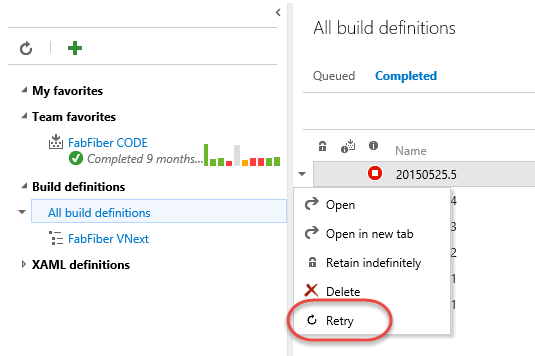

# Colins ALM Corner VSO Extensions

This repo contains some simple extensions - see [Extensions for Visual Studio Online](http://www.visualstudio.com/integrate/extensions/overview).

## Getting started

### Pre-requisites

1. [Join the Visual Studio Partner program](http://www.vsipprogram.com/join) to get early access to the Extensions feature
2. Verify the Extensions feature has been enabled on your account by navigating to ```https://youraccount.visualstudio.com/_admin/_ext```.
3. Available local or cloud web server with HTTPS (IIS, Node.js, Azure Web App, Heroku, etc)

### Steps

1. Clone this repo
2. Browse to the folder of the extension you are interested in trying
3. Publish the contents of the extension to a local or cloud web server
 * The root of the extension should be at the root of the web server, for example: https://myserver/images/fabrikam-logo.png
4. Update this extension manifest file:
  1. Update the `baseUri` field to be the fully-qualified URL to the root of your web server, for example: `https://myserver`
6. Install the extension into your Visual Studio Online account
  1. Navigate to ```https://youraccount.visualstudio.com/_admin/_ext``` (replace youraccount with your real account name)
  2. Click **Install** and browse to your manifest file, for example extension-me.json
  3. Click **OK**

## What's available

### Retry Build



Retry a build from the Completed Builds view.